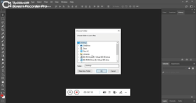

# Photoshop JS

Photoshop JS is an JS repository to automate actiions in photoshop to create images with multi dimension which contains Logo in it and Logo with primary color and background with secondary color entered.

 
 
